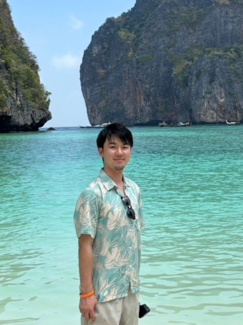

# Tomo's Portfolio (v2)

バックエンドエンジニア Tomo のポートフォリオサイト v2。
---

## 📁 ファイル構成

```
portfolio_tomo_v2/
├── index.html   # マークアップ
├── style.css    # スタイル
├── main.js      # スクロール進捗・リビールアニメ
├── photo.jpg    # ヒーロー画像（楕円トリミング用）
└── README.md
```

---

## 🚀 ローカルで動かす

```bash
cd portfolio_tomo_v2
open index.html   # Mac
# または index.html をブラウザにドラッグ&ドロップ
```

---

## ✨ 主な機能

- **左右分割ヒーロー**：左に大タイトル、右に楕円写真
- **写真の縁飾り**：薄い水色ラインがちょっと後ろにずれて配置されてオシャレ感
- **ホバーで写真スロー拡大**（8秒かけてゆっくり）
- **チェキ風 Works カード**（傾き＋ホバーで浮き上がり）
- **波型の区切り**：各セクション間
- **スクロール進捗バー**：上部に細いライン
- **セクションフェードイン**：スクロールに応じて入場

---

## 🛠 カスタマイズ

### ヒーロー写真を差し替える
`photo.jpg` を別の画像に置き換えるだけ。**縦長（4:5）の写真**が綺麗にハマります。

### About の顔写真を入れる
`index.html` の以下を：
```html
<div class="about-photo">
  <div class="about-photo-ph">photo<br>here</div>
</div>
```
↓ こうする
```html
<div class="about-photo">
  
</div>
```

### カラー変更
`style.css` の以下を一括置換すると、テーマカラーがまるごと変わります：
- メインの水色背景: `#d6edf7`
- アクセントカラー: `#2a8aaa`
- 濃い水色: `#1a6a8a`

### Works の3つを実物に差し替える
プレースホルダー（ブラウザ画面風）を実際のプロジェクトのスクリーンショットに差し替えるなら、`cheki-ph` ブロックの中身を：
```html
<div class="cheki-ph">
  
</div>
```

---

## 🎨 使用技術
- HTML / CSS / JavaScript（バニラ・ビルド不要）
- [Tabler Icons](https://tabler.io/icons)（CDN）
- [Google Fonts](https://fonts.google.com/) — Cormorant Garamond / DM Mono / Inter
---

## 📮 Contact
- Twitter: 
- Email: clalto31202@gmail.com
- GitHub: github.com/tomo

---

© Tomo
